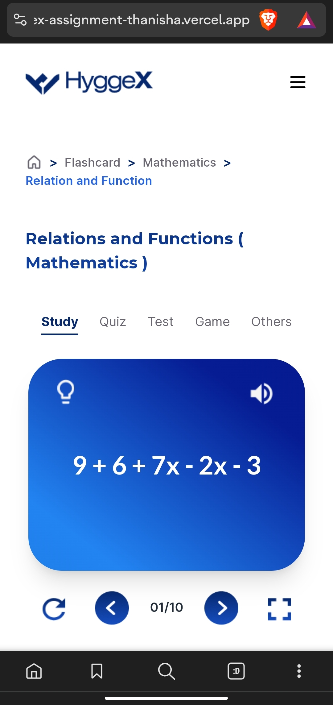
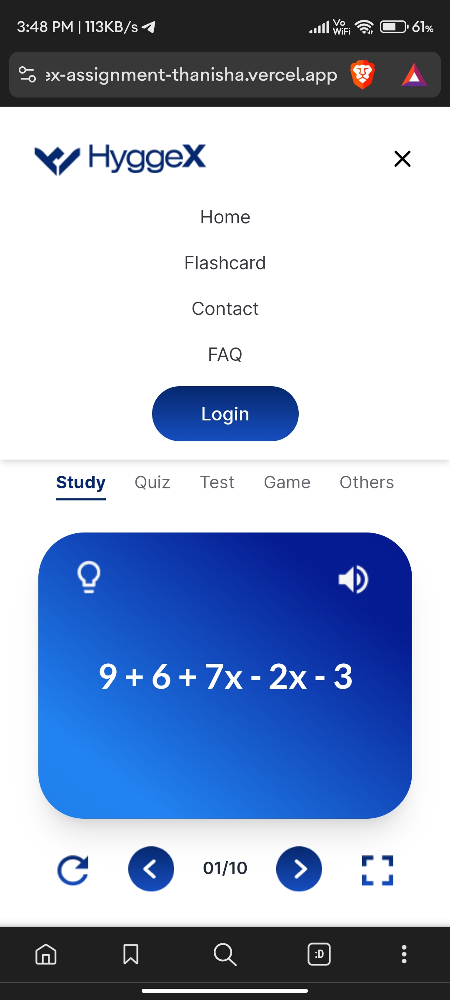

<h1 align="center">Hyggex</h1>
<p align="center">
  
</p>

#### Component using Reactjs, Tailwind css,and Typescript.

## Technology used:

- Reactjs
- Tailwind css
- Typescript

## Screenshots:

### Desktop View:

<table>
  <tr>
    <td>
      
    </td>
    <td>
      
    </td>
  </tr>
</table>

### Mobile View:

<table>
  <tr>
    <td>
      
    </td>
    <td>
      
    </td>
  </tr>
  <tr>
    <td>
      
    </td>
  </tr>
</table>


## Project Setup

1. Clone the repository

```
git clone https://github.com/Thanisha23/Hyggex-assignment.git
```

2. Navigate to the project directory and install dependencies for the project

```
npm install
```

3. Start the development server

```
npm run dev
```

<div align="center"><h4>Consider giving the project a star ⭐</h4></div>
<div align="center"><h4>Made by Thanisha Belchada</h4></div>